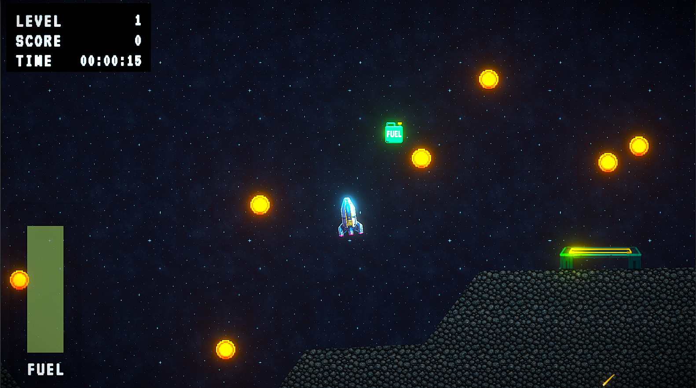
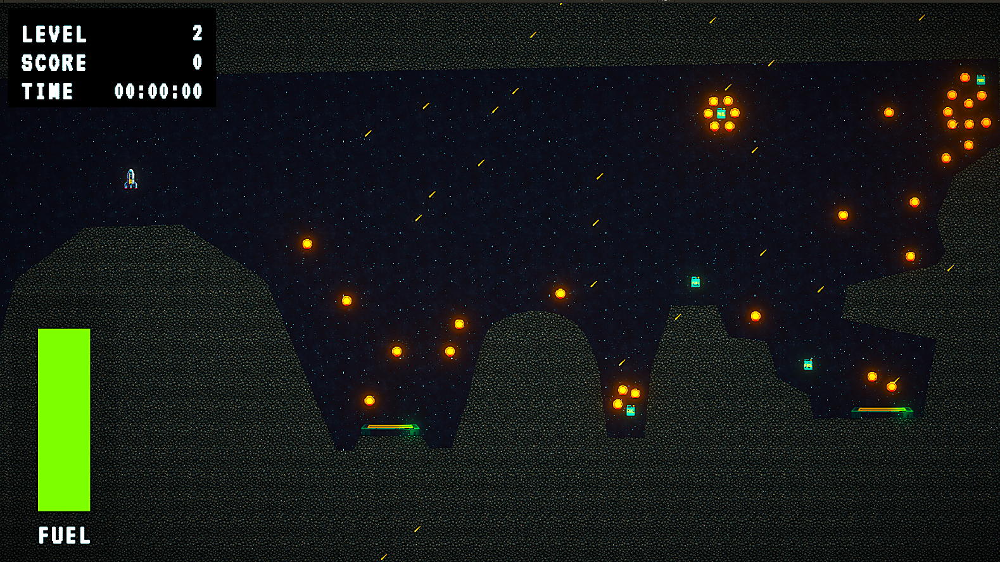

<h1>Starfall Rocket Lander</h1>

<strong>Starfall Rocket Lander</strong> is a 2D physics-based landing game built in Unity, inspired by classic platformer strategic series. Pilot a small lander ship, manage your fuel, and use precise thruster control to touch down safely on landing pads without crashing into the terrain.

  

<h2>🛰️ Project Overview</h2>

  Starfall Rocket Lander is a platformer project game that combines:

<ul>
  <li><strong>Realistic collision physics</strong> for realistic gravity and movement.</li>
  <li><strong>Thrust and rotation controls</strong> for the lander.</li>
  <li><strong>Fuel management</strong> that rewards careful flying.</li>
  <li><strong>Multiple landing pads</strong> with different purposes (refuel, level completion)</li>
  <li><strong>Clean C# architecture</strong> with events and a simple game state system</li>
</ul>

  The main goal of the project is to create a super realistic Unity game with enhanced input handling system and code scripts for a polished gameplay experience.

 

<h2>📦 Installation</h2>

Download the <strong><code>Starfall Rocket Lander Game.zip</code></strong> file and extract it. Inside the folder, run the <strong><code>Starfall Rocket Lander.exe</code></strong> file.

 

<h2>🎮 How to Play</h2>
<ul>
  <li><strong>Thrust UP</strong>: Press <strong>W</strong> to lift the lander against gravity.</li>
  <li><strong>Rotate Left / Right</strong>: Press <strong>A</strong> or <strong>D</strong> thrusters to orient the lander.</li>
  <li><strong>Arrow Keys</strong>: W,S,A,D keys are also functional through Arrow keys.</li>
  <li><strong>Fuel</strong>: Flying consumes fuel, so fly efficiently.</li>
  <li><strong>Landing</strong>: Align the lander <i>upright</i> and touch down <i>gently</i> on a landing pad.</li>
  <li><strong>Refuel</strong>: Certain pads can restore fuel so you can keep flying.</li>
</ul>

<strong>
  ⚠️The lander crashes hitting the terrain too hard or landing at a bad angle. A safe landing keeps the ship intact and lets you keep going⚠️</strong>

 

<h2>✨ Features</h2>
<ul>
  <li>2D physics-based lander movement using <code>Rigidbody2D.</code></li>
  <li>Advanced input handling through Unity's Input System.</li>
  <li>Fuel bar and basic UI feedback for game state.</li>
  <li>Rechargable pads that restore fuel when landed on.</li>
  <li>Event-driven architecture for landing, pickup, and state changes.</li>
  <li>Clean, readable C# code inspired by Code Monkey’s tutorial patterns</li>
</ul>

 
<h2>📱 Screenshots</h2>

  
  
  

 
<h2>🖥️ How to Run in Unity</h2>
<ol>
  <li>Clone or download the repository.</li>
  <li>Open the project in <strong>Unity</strong> (use the same or a compatible version used during development).</li>
  <li>Open the main scene (e.g., <code>GameScene.unity</code>).</li>
  <li>Press <strong>Play</strong> in the Unity Editor to start the game.</li>
</ol>

  Optionally, you can create a build via <strong>File &gt; Build Settings</strong> and run the game as a standalone application.

 

<h2>🛠️ Tools Used</h2>
<ul>
  <li><strong>Unity</strong> – Game engine</li>
  <li><strong>C#</strong> – Programming language</li>
  <li><strong>Visual Studio / VS Code</strong> – Code editor</li>
  <li><strong>Photoshop</strong> – For asset creation and colouration.</li>
</ul>

 

<h2>🔗 Tool Links</h2>

  
  
  
  

 

<h2>📚License</h2>

  <strong>Starfall Rocket Lander</strong> is a private, non-commercial educational project. It is inspired by classic lunar-lander games and developed both for educational & entertainment purposes only. All code and assets were created independently and are not copied from any external paid or proprietary sources. 
  This project is not intended for redistribution, sale, or commercial release.

 

<h2>👨‍💻 Developer</h2>
<ul>
  <li><a href="https://github.com/deepcodess" target="_blank">@DeepCodess</a></li>
</ul>
